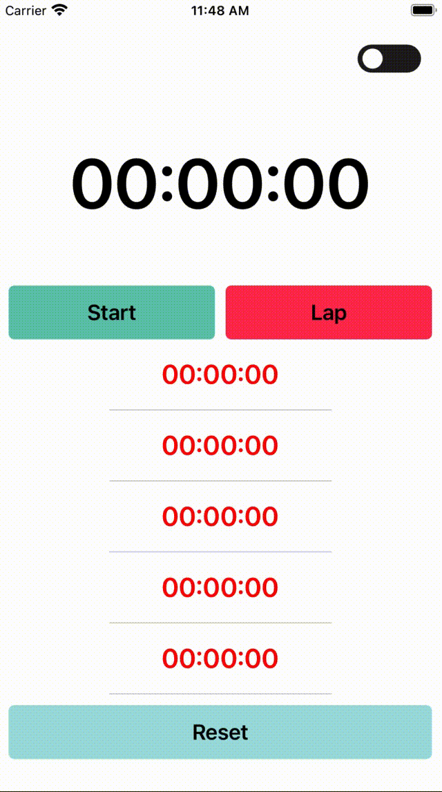
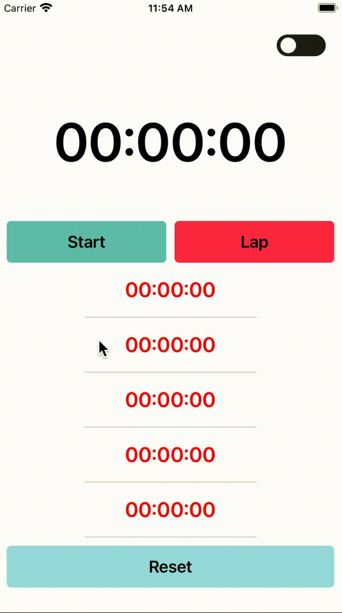
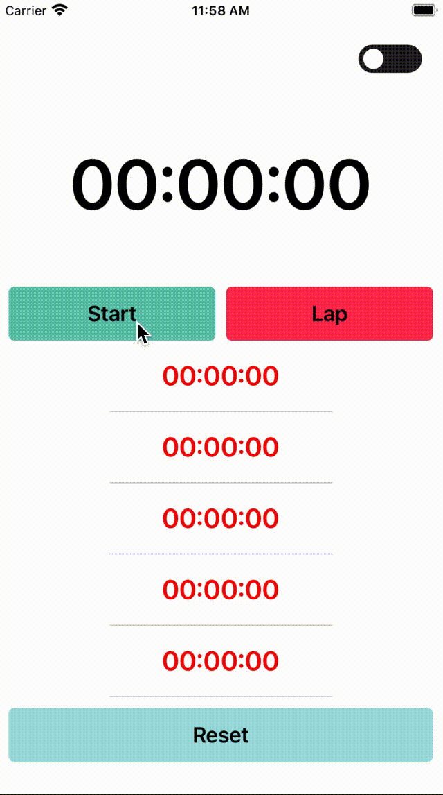

# StopWatchPlus

>랩타임 측정이 가능하고 화면에서 다크모드 전환이 가능한 스탑워치

## App 소개

 [ 개발 내용 ] : 스탑워치의 기본 기능 및 다크모드 화면에 구현

-Ti

- Timer()를 사용해 스탑워치 Play(재생), Pause, Lap 기능 구현
- 다크모드 전환 토글을 애니메이션 효과를 주는 Lottie 라이브러리 사용

- 개발 환경
  - 사용 Library : Lottie 
  - Design Architecture : MVC Pattern

- 개발 기간 : 4일 (제작 2일, 배포준비 2일)

## 주요 기능

>스탑워치의 기본 기능 및 다크모드 화면에 구현

- 스탑워치 기본 기능 구현
  - Start Button : 
  - Pause Button : 
  - Lap Button : 
  - Reset Button : 

|                         Start Button                         |                         Pause Button                         |                          Lap Button                          |                         Reset Button                         |
| :----------------------------------------------------------: | :----------------------------------------------------------: | :----------------------------------------------------------: | :----------------------------------------------------------: |
|  |  |  |  |

- 다크모드 화면 구현
  - 화면 오른쪽 상단에 있는 토글을 이용해 다크모드 전한을 할 수 있어 편리하게 전환할 수 있음
  - 시스템 다크모드 전화을 해제하고 

"Lab button"

랩타임 시간 연속으로 측정 가능

조작방법

- "Start" 버튼을 누르면 스톱워치가 시작
- "Stop"
- "Reset"