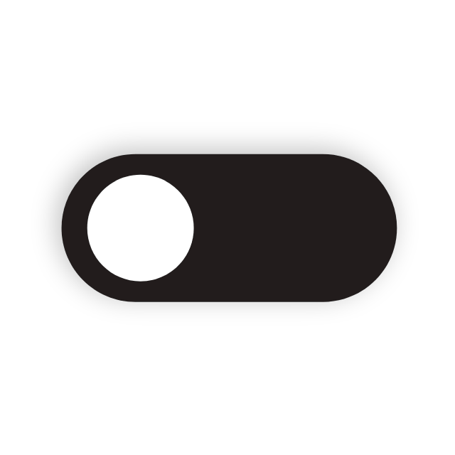
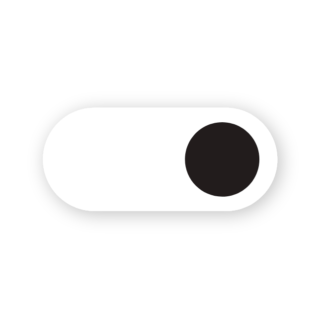

# StopWatchPlus

>랩타임 측정이 가능하고 화면에서 다크모드 전환이 가능한 스탑워치


<p align="center"></p>

<p align="center">StopWatchPlus</P>

<br>

<p align="center"></p>

<br><br>


<br>

## 1. 개요

>앱스토어 심사 과정을 경험하고자 스터디에서 진행한 스탑워치 어플을 보완해 업로드 진행

- **개발 내용**  : 스탑워치의 기본 기능 및 화면 내 다크모드 구현
  - Timer()를 사용해 스탑워치 Play, Pause, Lap, Reset 기능 구현
  - 다크모드 전환 토글을 애니메이션 효과를 주는 Lottie 라이브러리 사용
- **개발 환경**
  - 사용 Library : Lottie 
  - Design Architecture : MVC Pattern
- **개발 기간 ** : 4일 (제작 2일, 배포준비 2일)

<br>

## 2. 주요 기능 및 코드

>스탑워치의 기본 기능 및 다크모드 화면에 구현

### 2-1) 스탑워치 기본 기능

- `Start Button` : 타이머가 1초씩 증가하며 사용자는 시간, 분 , 초 단위를 정확하게 측정 가능
- `Pause Button` : 타이머의 시간을 일시정지 하는 기능으로 Start Button을 누르면 일시정지된 시간부터 다시 카운트됨
- `Lap Button` : 타이머에 지장을 주지 않고 시간을 연속적으로 체크하는 기능
- `Reset Button` : 스탑워치를 초기 상태로 전환해주는 기능

|                         Start Button                         |                         Pause Button                         |                          Lap Button                          |                         Reset Button                         |
| :----------------------------------------------------------: | :----------------------------------------------------------: | :----------------------------------------------------------: | :----------------------------------------------------------: |
|  |  |  |  |

<br>

### 2-2) 다크모드 화면 구현

- 화면 오른쪽 상단에 있는 토글을 이용해 다크모드 전한을 할 수 있어 편리하고 빠르게 전환할 수 있음
- 다크모드 전환시 색상이 변하는 토글을 적용해 직관적인 디자인을 구현
  - Light Mode에서 토글은 검은색이지만 Dark Mode로 전환되면 흰색으로 바뀜

|                      Dark Mode Convert                      |                   Dark Mode                    |                   Ligth Mode                    |
| :---------------------------------------------------------: | :--------------------------------------------: | :---------------------------------------------: |
|  |  |  |

<br>

#### [ 다크모드 해제 ]

>화면 내 다크모드 구현을 위해 시스템 다크모드 옵션을 해제

1. Info.plist

   - User Interface Style을 Light로 설정

2. `overrideUserInterfaceStyle`을 `light`로 설정

   - APP 전체에 주고 싶을 경우 `SceneDelegate`에서 진행

   ```swift
   window?.overrideUserInterfaceStyle = .light
   ```

   - 개별 UIViewController에 주고 싶을 경우 ViewController의 `viewDidLoad()`에서 진행 

   ```swift
   override func viewDidLoad() {
       super.viewDidLoad()
       self.overrideUserInterfaceStyle = .light // 다크모드 해제
   }
   ```


#### [ Status Bar에 DarkMode 적용 ]

📌  DarkMode를 배경색을 검은색으로만 지정해줘서 **UIStatusBar가 보이지 않게 됨**

>**Human Interface Guide - Status Bars**
>
>1. 시스템이 제공하는 status bar를 사용 (Use the system-provided status bar)
>2. 앱디자인에 맞춰 status bar 스타일을 조정 (Coordinate the status bar style with your app design)
>   - 예) LightMode에서는 어두운 스타일 적용,  DarkMode에서는 밝은 스타일 적용
>3. status bar 아래의 콘텐츠는 불투명해야 함 (Obscure content under the status bar)
>   - status bar 배경 default값은 transparent(투명)으로 status bar를 읽을 수 있게 내비게이션 바를 지정하거나 단색/그라데이션 이미지 또는 블러 처리된 이미지로 설정해야 함
>4. full-screen으로 미디어를 제공할 때 일시적으로 status bar를 숨김(Consider temporarily hiding the status bar when displaying full-screen media)

- Human Interface Guide의 2번을 어김 ➝ 배경색을 변경해 status bar 내용이 안보이게 됨


- `preferredStatusBarStyle`을 이용해 UIStatusBarStyle를 변경

  ```swift
  override var preferredStatusBarStyle: UIStatusBarStyle {
      if darkModeState {
          return .lightContent
      } else {
          return .darkContent
      }
  }
  ```

  

#### [Lottie 애니메이션 효과]

- `if - else` 문으로 DarkMode/LightMode를 구분하는 토글을 Lottie animation으로 적용

- 애니메이션은 클릭하면 작동할 수 있게 `UITapGestureRecognizer`를 사용

  |                         DarkMode                          |                         LightMode                          |
  | :-------------------------------------------------------: | :--------------------------------------------------------: |
  |  |  |

  

- 애니메이션 전환 속도에 맞춰 UIView의 전환 속도를 조절

  - `UIView.animate(withDuration: 1.5)`

- status bar 효과를 적용하기 위해 `setNeedsStatusBarAppearanceUpdate()`를 호출

  - statusbar 상태 변화 업데이트

  ```swift
  @objc func changeDarkMode(_ gesture: UITapGestureRecognizer){
      if !darkModeState {
          animationView.animation = Animation.named("darkModeChanger")
          animationView.contentMode = .scaleAspectFit
          animationView.play()
          darkModeState = true
          animationView.animationSpeed = 1.5
          UIView.animate(withDuration: 1.5) {
              self.view.backgroundColor = .black
              self.timeTextLabel.textColor = .white
              self.setNeedsStatusBarAppearanceUpdate() // statusbar 상태 변화 업데이트
              [self.lapLabel1, self.lapLabel2, self.lapLabel3, self.lapLabel4, self.lapLabel5].forEach{ $0.textColor = .red }
          }
      } else {
          animationView.animation = Animation.named("lightModeChanger")
          animationView.contentMode = .scaleAspectFit
          animationView.play()
          darkModeState = false
          animationView.animationSpeed = 1.5
          UIView.animate(withDuration: 1.5) {
              self.view.backgroundColor = .white
              self.timeTextLabel.textColor = .black
              self.setNeedsStatusBarAppearanceUpdate() // statusbar 상태 변화 업데이트
              [self.lapLabel1, self.lapLabel2, self.lapLabel3, self.lapLabel4, self.lapLabel5].forEach{ $0.textColor = .red }
          }
      }
  }
  ```

  